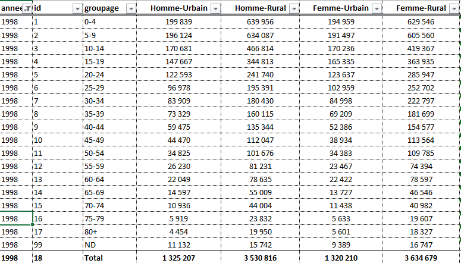

```{r setup, include=FALSE}
knitr::opts_chunk$set(echo = FALSE)

# Charger les packages
library(tidyverse)
library(readxl)
library(modelr)
library(knitr)
library(kableExtra)
library(RColorBrewer)

# Importer les données
censuses <- read_excel("mli_censuses.xlsx", sheet = 1)

```


# Pour commencer.... la _Data frame_?


## _Data frame_ (1)

Regardez les éléments suivants:
Que voyez-vous?
Des prénoms, n'est-ce pas?
De jolis prénoms!

```{r df_intro1 , echo=FALSE, out.width = '75%'}
nom <- c("Khadidja", "Fatima", "Lucie", "Tahirou", "Fousseynou", "Lionel")
as.vector(nom)

```

On peut choisir de visualiser ces prénoms de la façon suivante:
```{r df_intro2, echo=FALSE, out.width = '75%'}
nom <- c("Khadidja", "Fatima", "Lucie", "Khalil", "Fousseynou", "Lionel")
matrix(data = nom, nrow = 2, byrow = TRUE)

```

Quelle est la différence entre ces ensembles?
Le premier est un vecteur, le second une matrice.
Dans les deux cas, on a un ensemble homogène: des caractères (*string*).

## _Data frame_ (2)

Maintenant regardons l'âge de ce beau monde:
```{r df_intro3 , echo=FALSE, out.width = '75%'}
age <- c(24, 13, 42, 19, 28, 65)
as.vector(age)

```

Comme avant, on peut réorganiser ces données aussi:
```{r df_intro4, echo=FALSE, out.width = '75%'}
age <- c(24, 13, 42, 19, 28, 65)
matrix(data = age, nrow = 2, byrow = TRUE)

```

On peut même, s'amuser à faire des calculs:

moyenne = `r mean(age)`  

médiane = `r median(age)`  


## _Data frame_ (3)

Maintenant, imaginez que vous voulez mettre côte-à-côte les prénoms et les ages:
```{r df_intro5, echo=FALSE, out.width = '75%'}
mymatrix <- cbind(nom, age)

mymatrix

```

C'est mieux là, n'est-ce pas?
Mais que remarque-t-on?
Des _""_ autour des chiffres.
Retentons le calcul de l'âge moyen en prenant les données de ce tableau.
On obtient: `r mean(mymatrix[, 2])`.
_NA_ designant _Non Available_, or l'on voit bien les chiffres.
Toutefois, ils ne sont pas reconnus comme tels.
C'est là qu'entre en scène la _Data frame_

## _Data frame_ (4)
C'est un format de données rectangulaires (des colonnes et des lignes).
C'est surtout un format qui permet de combiner des éléments de diverses natures.
Regardons ça:

```{r df_intro6, echo=FALSE, out.width = '75%'}
mydf <- data.frame(nom, age)
mydf
```

On remarque là que les "" ont disparu.
Les chiffres sont reconnus comme tels.
Allons peu plus loin en ajoutant de nouvelles informations.


## _Data frame_ (5)

Ajoutons de nouvelles informations:
```{r df_intro7, echo=FALSE, out.width = '75%'}
nom <- c("Khadidja", "Fatima", "Lucie", "Khalil", "Fousseynou", "Lionel")
age <- c(24, 13, 42, 19, 28, 65)
sexe <- c("féminin", "féminin", "féminin", "masculin", "masculin", "masculin")
taille <- c(1.75, 1.55, 1.72, 1.85, 1.73, 1.81)
poids <- c(62, 51, 79, 87, 60, 72)

mydf <- data.frame(nom, age, sexe, taille, poids)
mydf

```

Là, nous voyons des données rectangulaires comme on en trouve souvent dans les enquêtes.

## _Data frame_ (6)

Sans le savoir, nous avons crééé un format de données organisées (*tidy data*).
Ces données respectent le principe de base du format _tidy_:

- chaque ligne est une observation;

- chaque colonne est un attribut.


Sans le savoir, toutefois, ce principe est souvent violé.

## _Data frame_ (7)
Imaginez que ces personnes aient été observées il y a 5 ans, et que l'on souhaite reconduire les informations issues de cette observation:

```{r df_intro8, echo=FALSE, out.width = '70%'}
nom <- c("Khadidja", "Fatima", "Lucie", "Khalil", "Fousseynou", "Lionel")
age2018 <- c(24, 13, 42, 19, 28, 65)
age2013 <- c(19, 8, 37, 14, 23, 60)
sexe <- c("féminin", "féminin", "féminin", "masculin", "masculin", "masculin")
taille2018 <- c(1.75, 1.55, 1.72, 1.85, 1.73, 1.81)
taille2013 <- c(1.70, 1.20, 1.72, 1.40, 1.73, 1.81)
poids2013 <- c(57, 41, 85, 57, 60, 71)
poids2018 <- c(62, 51, 79, 87, 60, 72)
mydf <- data.frame(nom, age2018, sexe, taille2018, taille2013, poids2018, poids2013)
mydf

```

Qu'est-ce qui ne va pas ici?
Différentes colonnes font référence au même attribut:

- `taille2018` et `taille2013`: ça reste toujours la taille!

- `poids2018` et `poids2013`:  ça reste toujours le poids!

## _Data frame_ (8)
Que faire?
Reorganiser les données.

```{r df_intro9, echo=FALSE, out.width = '70%', warning=FALSE}
nom <- c("Khadidja", "Fatima", "Lucie", "Khalil", "Fousseynou", "Lionel")
age_2018 <- c(24, 13, 42, 19, 28, 65)
age_2013 <- c(19, 8, 37, 14, 23, 60)
sexe_2018 <- c("féminin", "féminin", "féminin", "masculin", "masculin", "masculin")
sexe_2013 <- c("féminin", "féminin", "féminin", "masculin", "masculin", "masculin")
taille_2018 <- c(1.75, 1.55, 1.72, 1.85, 1.73, 1.81)
taille_2013 <- c(1.70, 1.20, 1.72, 1.40, 1.73, 1.81)
poids_2013 <- c(57, 41, 85, 57, 60, 71)
poids_2018 <- c(62, 51, 79, 87, 60, 72)
mydf <- data.frame(nom, age_2018, age_2013, sexe_2013, sexe_2018, taille_2018, taille_2013, poids_2018, poids_2013)

mydf %>% 
  gather(key = variable, value = valeur, -nom) %>% 
  separate(variable, c("variable", "annee"), sep = "_") %>% 
  spread(key = variable, value = valeur) %>% 
  head()

```

Là, on retrouve le principe _tidy_.
Maintenant, chaque ligne est une observation.
Une observation qui n'est pas forcément la même chose que le sujet.
Plusieurs observations peuvent être conduites sur un même sujet (données de panel).


## _Data frame_ (9)

Imaginons un autre cas.
Supposons que l'on veuille seulement voir les personnes qui ont des enfants et faire apparaitre le nom de ces derniers.
Concentrons nous ici sur Lionel!

```{r df_intro10, echo=FALSE, out.width = '75%'}
nom <- c("Lionel", "Lionel", "Lionel", "Lionel", "Lionel", "Lionel")
age <- c(65, 65, 65, 65, 65, 65)
sexe <- c("masculin", "masculin", "masculin", "masculin", "masculin", "masculin")
taille <- c(1.81, 1.81, 1.81, 1.81, 1.81, 1.81)
poids <- c(72, 72, 72, 72, 72, 72)
enfant <- c("Sara", "Marthe", "Lionel Jr.", "Fousseynou", "Amy", "Raphael")

mydf <- data.frame(nom, age, sexe, taille, poids, enfant)
mydf

```

Ici, sous la perspective des enfants, les données sont _tidy_, mais les informations sur Lionel apparaissent de façon redondante.
Pour ce genre de données, on fait recours à une base relationnelle.
Les données sont séparées de sorte à ce que chaque table soit _tidy_, mais des clés (primaires et étrangères) sont crééés pour permettre la jointure.

## _Data frame_ (10)
On aura d'un coté une _data frame_ pour les enfants qui peut contenir autant d'attributs que possibles:

```{r df_intro11, echo=FALSE, out.width = '75%'}
pere <- c("Lionel", "Lionel", "Lionel", "Lionel", "Lionel", "Lionel")
enfant <- c("Sara", "Marthe", "Lionel Jr.", "Fousseynou", "Amy", "Raphael")
sexe <- c("féminin", "féminin", "masculin", "masculin", "féminin", "masculin")

mydf <- data.frame(pere, enfant, sexe)
mydf

```

et de l'autre, l'ancienne _data frame_ qui ne conservera que les individus qui ont des enfants.


## _Data frame_ (11)

- Est-ce obligatoire d'avoir / de mettre les données en format _tidy_?

Non.
Comme nous le verrons, on peut bien visualiser et analyser des données sans les mettre sous format _tidy_

- Pourquoi se donner la peine alors?

Parce que ce format se prête facilement à la manipulation avec des outils existants dans **R**.
Ces outils sont connus sous le nom de *tidyverse*.
Nous allons montrer l'avantage de ces outils.


# _Tidy data_: illustration avec des données démographiques


## Données démographiques

Pour illustrer, nous allons prendre des données démographiques: la population malienne répartie par:

- groupe d'âge (tranches de 5 ans);

- par sexe (homme-femme);

- par milieu (urbain-rural).

Ces données ont été tirées des:

- recensements menés en 1976, 1987, 1998 et 2009;

- de tableaux complémentaires publiés dans les Annuaires Statistiques, et certains tirés des les enquêtes sur les ménages.

Pour retrouver les documents, consulter la page : https://www.malikunnafoni.com


## Sous Microsotf Excel (1)

A quoi ressemblent ces données sous Ms Excel ?

```{r mli_censuses_pix1 , echo=FALSE, fig.cap="Dataframe dans MS Excel", out.width = '100%'}


```

## Sous Microsotf Excel (2)

Zoomons un peu plus.

```{r mli_censuses_pix2 , echo=FALSE, fig.cap="Dataframe dans MS Excel: zoom", out.width = '100%'}



```

## Sous Microsotf Excel (3)

On peut même faire des graphiques. C'est bien non ?

```{r mli_censuses_gph1, echo=FALSE, fig.cap="Graph dans MS Excel: barres empilées (population, 2009)", out.width = '100%'}


```


## Sous Microsotf Excel (4)

Absolument!


Et si l'on voulais faire une pyramide des âges ?


Alors là....

## Sous Microsotf Excel (5)

...il faudrait reorganiser les données...

```{r mli_censuses_pix3 , echo=FALSE, fig.cap="Dataframe dans MS Excel: un autre", out.width = '100%'}


```


## Sous Microsotf Excel (6)

...et éditer un nouveau graphique.

```{r mli_censuses_gph2, echo=FALSE, fig.cap="Graph dans MS Excel: barres (pyramide des âges, 2009)", out.width = '100%'}


```

## Sous Microsotf Excel (7)


Et si l'on voulait comparer les tranches d'âge sur deux années?

Disons, 1998 et 2009, les deux derniers recensements en date!

Là aussi, il faudrait...


## Sous Microsotf Excel (8)

...reorganiser les données et...

```{r mli_censuses_pix4 , echo=FALSE, fig.cap="Dataframe dans MS Excel: encore un autre", out.width = '95%'}


```


## Sous Microsotf Excel (9)

...éditer un nouveau graphique...

```{r mli_censuses_gph3, echo=FALSE, fig.cap="Graph dans MS Excel: barres (population: 1998 vs 2009)", out.width = '100%'}


```


## Sous Microsotf Excel (10)

Imaginez:

- si vous devez faire des pyramides pour toutes les régions, tous les cercles, toutes les communes? Où trouveriez-vous le temps de faire tous ces "clics" ? (pourriez-vous survivre à une telle épreuve?)

- si vous devez collaborer en temps réel avec d'autres personnes ces pyramides? Comment partageriez-vous le fichier ?

- si vous veniez à perdre votre fichier, ou avoir un virus ou à avoir votre version corrompue? Que feriez-vous?

Voici autant de raisons qui justifient l'adoption de langages/logiciels comme R pour le traitement de données.


## Sous R (1)

Que voit-on une fois dans le monde R?

```{r mli_censuses_tbl1, echo = FALSE, message=FALSE, warning=FALSE}

# Présenter les données
censuses %>% 
  filter(annee == 2009) %>% 
  select(annee, id, `groupage`, `Homme-Urbain`, `Homme-Rural`, `Femme-Urbain`, `Femme-Rural`, source, office) %>% 
  head(n = 5) %>% 
  kable(caption = 'Un aperçu des données rectangulaires') %>% 
  kable_styling(c("striped", "hover","condensed", "responsive"), 
                full_width = F, font_size = 6, position = "float_left") 
```

## Sous R (2)

L'histoire n'est pas finie.
Nous n'avons toujours pas la clé à l'univers magique _tidyverse_.
Les données ne sont pas organisées sur les principes _tidy_ qui sont les suivants:

- chaque ligne est une observation ;

- chaque colonne est un attribut.

Jettons un autre coup d'oeil aux données.

## Sous R (3)

```{r mli_censuses_tbl2, echo = FALSE, message=FALSE, warning=FALSE}

# Présenter les données, à nouveau
censuses %>% 
  filter(annee == 2009) %>% 
  select(annee, id, groupage, `Homme-Urbain`, `Homme-Rural`, `Femme-Urbain`, `Femme-Rural`, source, office) %>%
  head() %>%
  kable(caption = 'Un aperçu des données rectangulaires, encore') %>% 
  kable_styling(c("striped", "hover","condensed", "responsive"), 
                full_width = F, font_size = 6, position = "float_left")

```


## Sous R (4)

Qu'est-ce qui ne va pas?

- `Homme` et `Femme` apparaissent en colonnes, or ce sont deux catégories du même attribut: le sexe;

- `Urbain` et `Rural` apparaissent en colonnes, or ce sont deux catégories du même attribut: le milieu.

On doit passer du format large (*wide*) au format long (*long* ou ici *tidy*).


## Sous R (5)

En reorganisant les données, on obtient:

```{r mli_censuses_tbl3, echo = FALSE, message=FALSE, warning=FALSE}

# Reorganiser les données

censuses_tidy <- 
  censuses %>%
  select(annee, id, groupage, `Homme-Urbain`, `Homme-Rural`, `Femme-Urbain`, `Femme-Rural`, source, office) %>%
  gather(key = categorie, value = population, -c(annee, id, groupage, source, office)) %>% 
  separate(categorie, c('sexe', 'milieu'), sep = '-') %>% 
  select(annee, id, groupage, sexe, milieu, population, source, office)

censuses_tidy %>% 
  filter(annee == 2009) %>% 
  head() %>% 
  kable(caption = 'Des données tidy') %>% 
  kable_styling(c("striped", "hover","condensed", "responsive"), 
                full_width = F, font_size = 6, position = "float_left") 
```

## Sous R (6)

Revoyons les données, mais sous un autre angle:

```{r mli_censuses_tbl4, echo=TRUE, message=FALSE, warning=FALSE}

# Un coup d'oeil
censuses_tidy
```


## Sous R (7)

Que gagnons-nous à les avoir sous cette forme?
La réponse: tout!
D'ici, il est possible de faire les mêmes graphiques que dans Excel, et plus encore.
Par dessus tout, ici on est libéré des limites d'Excel. 
Juste trois arguments (en rapport avec les questions soulevées):

- l'évolutivité (*scalability*) : des fonctions exécutant des tâches en boucles (plutôt que les 'clics');

- la reproductibilité du travail à travers des scripts qui facilitent la collaboration et garantissent la transparence;

- le contrôle des versions avec la technologie Git (si ces meetups continuent, on en parlera, inévitablement): on peut aller en avant et revenir en arrière à souhait.

## Sous R (8)

Maintenant, passons dans le _tidyverse_ avec _tidy data_.


# _Tidyverse_ en action (enfin, juste un petite demonstration)

## L'écosystème du _tidyverse_

- Nous y sommes déjà, depuis le début de la présentation, ce sont des outils du _tidyverse_ qui sont à l'oeuvre

- Un ensemble d'outils (packages) élaborés séparemment, mais de sorte à fonctionner ensemble et bâtis avec le même esprit

- Regardons comment est-ce que nos données rectangulaires _tidy_ se prêtent à une variété de tâches


## Reprenons les graphiques (1)

```{r mli_censuses_gph3 , echo=FALSE, fig.cap="Population du Mali, 2009", out.width = '100%'}

# Population en 2009
censuses_tidy %>% 
  filter(annee == 2009, 
         id < 18) %>% 
  unite("sexemilieu", c(sexe, milieu), sep = "-") %>% 
  ggplot(aes(x = reorder(groupage, id), y = population/1e3, fill = sexemilieu)) +
  geom_col(position = "stack") +
  theme(axis.text.x = element_text(angle = 45, size = 7),
        plot.caption = element_text(size = 7) ) + 
  scale_fill_brewer(type = "seq", palette = "Set1") +
  labs(x = "", y = "Population (milliers)", fill = "Sexe-Milieu",
       caption = "Source: A partir de données tirées de https://www.malikunnafoni.com",
       subtitle = "Visualiser comme dans Excel: les barres empilées")

```


## Reprenons les graphiques (1) (codes) {.smaller}

Regardez seulement le point de départ: `censuses_tidy`

```{r mli_censuses_gph3code, eval=FALSE, echo=TRUE, fig.cap="Population du Mali, 2009", out.width = '100%'}

# Population en 2009
censuses_tidy %>% 
  filter(annee == 2009,
         id < 18) %>% 
  unite("sexemilieu", c(sexe, milieu), sep = "-") %>% 
  ggplot(aes(x = reorder(groupage, id), y = population/1e3, fill = sexemilieu)) +
  geom_col(position = "stack") +
  theme(axis.text.x = element_text(angle = 45, size = 7),
        plot.caption = element_text(size = 7) ) + 
  scale_fill_brewer(type = "seq", palette = "Set1") +
  labs(x = "", y = "Population (milliers)", fill = "Sexe-Milieu",
       caption = "Source: A partir de données tirées de https://www.malikunnafoni.com",
       subtitle = "Visualiser comme dans Excel: les barres empilées")

```
C'est le dataframe (données en format rectangulaire) que nous avons créeé à partir du fichier Excel: `censuses_tidy`.
Vous le retrouverez partout!

## Reprenons les graphiques (2)

```{r mli_censuses_gph4 , echo=FALSE, fig.cap="Population du Mali: la pyramide des âges, 2009", out.width = '100%'}

# Population en 2009
censuses_tidy %>% 
  filter(annee == 2009,
         id < 18) %>% 
  group_by(id, groupage, sexe) %>% 
  summarise(population = sum(population)) %>% 
  mutate(population = ifelse(sexe == "Femme", -population, population)) %>% 
  ggplot(aes(x = reorder(groupage, id), y = population/1e3, fill = sexe)) +
  geom_col(position = "stack") +
  coord_flip() +
  theme(plot.caption = element_text(size = 7) ) + 
  scale_fill_brewer(type = "seq", palette = "Set1") + 
  scale_y_continuous(labels = abs) +
  labs(x = "", y = "Population (milliers)", fill = "Sexe",
       caption = "Source: A partir de données tirées de https://www.malikunnafoni.com",
       subtitle = "Visualiser comme dans Excel: la pyramide des âges")

```


## Reprenons les graphiques (2) (codes)  {.smaller}

```{r mli_censuses_gph4code, eval=FALSE, echo=TRUE, fig.cap="Population du Mali: la pyramide des âges, 2009", out.width = '100%'}

# Population en 2009
censuses_tidy %>% 
  filter(annee == 2009,
         id < 18) %>% 
  group_by(id, groupage, sexe) %>% 
  summarise(population = sum(population)) %>% 
  mutate(population = ifelse(sexe == "Femme", -population, population)) %>% 
  ggplot(aes(x = reorder(groupage, id), y = population/1e3, fill = sexe)) +
  geom_col(position = "stack") +
  coord_flip() +
  theme(plot.caption = element_text(size = 7) ) + 
  scale_fill_brewer(type = "seq", palette = "Set1") + 
  scale_y_continuous(labels = abs) +
  labs(x = "", y = "Population (milliers)", fill = "Sexe",
       caption = "Source: A partir de données tirées de https://www.malikunnafoni.com",
       subtitle = "Visualiser comme dans Excel: la pyramide des âges")

```

Il encore est là!

## Reprenons les graphiques (3)

```{r mli_censuses_gph5 , echo=FALSE, fig.cap="Population du Mali, 1998 vs 2009", out.width = '100%'}

# Population: 1998 vs 2009
censuses_tidy %>% 
  filter(annee %in% c(1998, 2009),
         id < 18) %>% 
  group_by(annee, id, groupage) %>% 
  summarise(population = sum(population)) %>% 
  ggplot(aes(x = reorder(groupage, id), y = population/1e3, fill = factor(annee))) +
  geom_col(position = "dodge") +
  coord_flip() +
  theme(plot.caption = element_text(size = 7) ) + 
  scale_fill_brewer(type = "seq", palette = "Set1") + 
  labs(x = "", y = "Population (milliers)", fill = "Année",
       caption = "Source: A partir de données tirées de https://www.malikunnafoni.com",
       subtitle = "Visualiser comme dans Excel: comparaison entre années")

```


## Reprenons les graphiques (3) (codes)  {.smaller}

```{r mli_censuses_gph5code, eval=FALSE, echo=TRUE, fig.cap="Population du Mali, 1998 vs 2009", out.width = '100%'}

# Population: 1998 vs 2009
censuses_tidy %>% 
  filter(annee %in% c(1998, 2009),
         id < 18) %>% 
  group_by(annee, id, groupage) %>% 
  summarise(population = sum(population)) %>% 
  ggplot(aes(x = reorder(groupage, id), y = population/1e3, fill = factor(annee))) +
  geom_col(position = "dodge") +
  coord_flip() +
  theme(plot.caption = element_text(size = 7) ) + 
  scale_fill_brewer(type = "seq", palette = "Set1") + 
  scale_y_continuous(labels = abs) +
  labs(x = "", y = "Population (milliers)", fill = "Année",
       caption = "Source: A partir de données tirées de https://www.malikunnafoni.com",
       subtitle = "Visualiser comme dans Excel: comparaison entre années")

```

Il encore est là!

## Arrêtons-nous un instant

Là réside la force du _tidyverse_ et des _tidy data_.
Une fois que les données sont dans la bonne forme - ici _tidy_ -, elles deviennent malléables.
Les outils du _tidyverse_ permettent le séquençage des tâches (avec les _pipes_ - vous saurez bientôt ce que c'est!).
On peut ainsi partir des données _tidy_ vers la visualisation, la modélisation ou souvent les deux, et plus encore.
Avec les outils du _tidyverse_, les données organisées en format _tidy_ se positionnent en point de départ du _workflow_ du _data scientist_!

Maintenant, amusons-nous à soulever quelques questions et à tenter d'y apporter des réponses tout en gardant cette démarche: notre _tidy data_ comme point de départ du _workflow_.

## Allons plus loin: les graphiques (1)

La pyramide des âges diffère-t-elle beaucoup entre milieu urbain et milieu rural?

```{r mli_censuses_gph6 , echo=FALSE, fig.cap="Population du Mali: la pyramide des âges urbain vs rural, 2009", out.width = '90%'}

# Population en 2009: urbain versus rural
censuses_tidy %>% 
  filter(annee == 2009,
         id < 18) %>% 
  mutate(population = ifelse(sexe == "Femme", -population, population)) %>% 
  ggplot(aes(x = reorder(groupage, id), y = population/1e3, fill = sexe)) +
  geom_col(position = "stack") +
  coord_flip() +
  facet_wrap(~milieu, scales = "free_x") +
  theme(plot.caption = element_text(size = 7) ) + 
  scale_fill_brewer(type = "seq", palette = "Set1") +
  scale_y_continuous(labels = abs) +
  labs(x = "", y = "Population (milliers)", fill = "Sexe",
       caption = "Source: A partir de données tirées de https://www.malikunnafoni.com",
       subtitle = "Visualiser comme dans Excel: la pyramide des âges")

```


## Allons plus loin: les graphiques (1) (c) {.smaller}

```{r mli_censuses_gph6code, eval=FALSE, echo=TRUE, fig.cap="Population du Mali: la pyramide des âges urbain vs rural, 2009", out.width = '100%'}

# Population en 2009: urbain versus rural
censuses_tidy %>% 
  filter(annee == 2009,
         id < 18) %>% 
  mutate(population = ifelse(sexe == "Femme", -population, population)) %>% 
  ggplot(aes(x = reorder(groupage, id), y = population/1e3, fill = sexe)) +
  geom_col(position = "stack") +
  coord_flip() +
  facet_wrap(~milieu, scales = "free_x") +
  theme(plot.caption = element_text(size = 7) ) + 
  scale_fill_brewer(type = "seq", palette = "Set1") +
  scale_y_continuous(labels = abs) +
  labs(x = "", y = "Population (milliers)", fill = "Sexe",
       caption = "Source: A partir de données tirées de https://www.malikunnafoni.com",
       subtitle = "Visualiser comme dans Excel: la pyramide des âges")

```

`censuses_tidy` est toujours là!

## Allons plus loin: les graphiques (2)

Comment est-ce la population a évolué entre 1976 et 2009 au Mali?
Quelle a été le volume de chaque groupe d'âge?

```{r mli_censuses_gph7, echo=FALSE, fig.cap="Population du Mali: par tranche d'âge, 1976-2009", out.width = '90%', message=FALSE, warning=FALSE}

# Quelques manipulations élargir la palette de couleurs
getPalette <- colorRampPalette(brewer.pal(9, "Set2"))

# Population: 1976-2009, par groupe d'âge
censuses_tidy %>% 
  filter(source == "RGPH", id < 18) %>% 
  group_by(annee, id, groupage) %>% 
  summarise(population = sum(population)) %>% 
  ggplot(aes(x = annee, y = population/1e6, fill = reorder(groupage, id))) +
  geom_area(position = "stack") +
  theme(plot.caption = element_text(size = 7),
        legend.text = element_text(size = 8),
        legend.key.size = unit(0.5, "cm")) + 
  scale_fill_manual(values = getPalette(17)) +
  scale_x_continuous(breaks = c(1976, 1987, 1998, 2009)) +
  labs(x = "Année", y = "Population (millions)", fill = "Tranche d'âge",
       caption = "Source: A partir de données tirées de https://www.malikunnafoni.com",
       subtitle = "La population de 1976 à 2009, par tranche d'âge. Assez d'informations! Peut-être trop! ")

```


## Allons plus loin: les graphiques (2) (c)  {.smaller}


```{r mli_censuses_gph7code, eval=FALSE, echo=TRUE, fig.cap="Population du Mali: par tranche d'âge, 1976-2009", out.width = '100%', message=FALSE, warning=FALSE}

# Quelques manipulations élargir la palette de couleurs
getPalette <- colorRampPalette(brewer.pal(9, "Set2"))

# Population: 1976-2009, par groupe d'âge
censuses_tidy %>% 
  filter(source == "RGPH", id < 18) %>% 
  group_by(annee, id, groupage) %>% 
  summarise(population = sum(population)) %>% 
  ggplot(aes(x = annee, y = population/1e6, fill = reorder(groupage, id))) +
  geom_area(position = "stack") +
  theme(plot.caption = element_text(size = 7),
        legend.text = element_text(size = 8),
        legend.key.size = unit(0.5, "cm")) + 
  scale_fill_manual(values = getPalette(17)) +
  scale_x_continuous(breaks = c(1976, 1987, 1998, 2009)) +
  labs(x = "Année", y = "Population (millions)", fill = "Tranche d'âge",
       caption = "Source: A partir de données tirées de https://www.malikunnafoni.com",
       subtitle = "La population de 1976 à 2009, par tranche d'âge. Assez d'informations! Peut-être trop! ")

```

`censuses_tidy` : il n'est pas prêt de bouger celui-là!


## Allons plus loin: les graphiques (3)

Cherchons une réponse plus simple à la même question....mais pas trop simple.

```{r mli_censuses_gph8, echo=FALSE, fig.cap="Population du Mali: par tranche d'âge, 1976-2009", out.width = '90%', message=FALSE, warning=FALSE}

# Population: 1976-2009, par groupe d'âge
censuses_tidy %>% 
  filter(source == "RGPH", id < 18) %>% 
  mutate(groupage2 = case_when(id > 0 & id <= 3 ~ "0-14",
                               id > 3 & id <= 13 ~ "15-64",
                               id > 13 & id <= 17 ~ "64 +")) %>% 
  group_by(annee, groupage2) %>% 
  summarise(population = sum(population)) %>% 
  ggplot(aes(x = annee, y = population/1e6, fill = groupage2)) +
  geom_area(position = "stack") +
  theme(plot.caption = element_text(size = 7),
        legend.text = element_text(size = 8),
        legend.key.size = unit(0.5, "cm")) + 
  scale_fill_brewer(type = "seq", palette = "Set2") +
  scale_x_continuous(breaks = c(1976, 1987, 1998, 2009)) +
  labs(x = "Année", y = "Population (millions)", fill = "Tranche d'âge",
       caption = "Source: A partir de données tirées de https://www.malikunnafoni.com",
       subtitle = "La population de 1976 à 2009, par tranche d'âge. Mieux qu'avant, non? ")
```


## Allons plus loin: les graphiques (3) (c) {.smaller}

```{r mli_censuses_gph8code, eval=FALSE, echo=TRUE, fig.cap="Population du Mali: par tranche d'âge, 1976-2009", out.width = '90%', message=FALSE, warning=FALSE}

# Population: 1976-2009, par groupe d'âge
censuses_tidy %>% 
  filter(source == "RGPH", id < 18) %>% 
  mutate(groupage2 = case_when(id > 0 & id <= 3 ~ "0-14",
                               id > 3 & id <= 13 ~ "15-64",
                               id > 13 & id <= 17 ~ "64 +")) %>% 
  group_by(annee, groupage2) %>% 
  summarise(population = sum(population)) %>% 
  ggplot(aes(x = annee, y = population/1e6, fill = groupage2)) +
  geom_area(position = "stack") +
  theme(plot.caption = element_text(size = 7),
        legend.text = element_text(size = 8),
        legend.key.size = unit(0.5, "cm")) + 
  scale_fill_brewer(type = "seq", palette = "Set2") +
  scale_x_continuous(breaks = c(1976, 1987, 1998, 2009)) +
  labs(x = "Année", y = "Population (millions)", fill = "Tranche d'âge",
       caption = "Source: A partir de données tirées de https://www.malikunnafoni.com",
       subtitle = "La population de 1976 à 2009, par tranche d'âge. Mieux qu'avant, non? ")

```


- "`censuses_tidy`"? 

- "Présent!"


## Allons plus loin: les graphiques (4)

Quelle lecture peut-on faire des taux de croissance de la population, tranche d'âge, par sexe et par milieu ?

```{r mli_censuses_gph9, echo=FALSE, fig.cap="Population du Mali: taux de croissance, 1976-2009", out.width = '90%', message=FALSE, warning=FALSE}

# Population: La contribution des tranches d'âge à la croissance démographique, urbain vs rural
censuses_tidy %>% 
  filter(source == "RGPH", id < 18) %>% 
  group_by(groupage, sexe, milieu) %>% 
  mutate(rate = population / lag(population),
         duration = annee - lag(annee),
         perannum = rate^(1/duration),
         taux = (-1 + perannum)*100,
         periode = paste(lag(annee), annee, sep = "-")) %>% 
  filter(!is.na(taux)) %>% 
  ggplot(aes(x = periode, y = taux)) +
  geom_boxplot() +
  geom_point(aes(color = milieu), position = "jitter") + 
  theme(plot.caption = element_text(size = 7),
        legend.text = element_text(size = 8),
        legend.key.size = unit(0.5, "cm")) + 
  labs(x = "Période", y = "Taux de croissance annuel / groupe d'âge", color = "Milieu",
       caption = "Source: A partir de données tirées de https://www.malikunnafoni.com",
       subtitle = "Croissance démographique plus prononcée en milieu rural entre 1998 et 2009. \n Ralentissement de l'exode rural ou signe de saturation des grandes villes? ")
```


## Allons plus loin: les graphiques (4) (c) {.smaller}

```{r mli_censuses_gph9code, eval=FALSE, echo=TRUE, fig.cap="Population du Mali: taux de croissance, 1976-2009", out.width = '90%', message=FALSE, warning=FALSE}

# Population: Le taux de croissance, par tranche d'âge, urbain vs rural
censuses_tidy %>% 
  filter(source == "RGPH", id < 18) %>% 
  group_by(groupage, sexe, milieu) %>% 
  mutate(rate = population / lag(population),
         duration = annee - lag(annee),
         perannum = rate^(1/duration),
         taux = (-1 + perannum)*100,
         periode = paste(lag(annee), annee, sep = "-")) %>% 
  filter(!is.na(taux)) %>% 
  ggplot(aes(x = periode, y = taux)) +
  geom_boxplot() +
  geom_point(aes(color = milieu), position = "jitter") + 
  theme(plot.caption = element_text(size = 7),
        legend.text = element_text(size = 8),
        legend.key.size = unit(0.5, "cm")) + 
  labs(x = "Période", y = "Taux de croissance annuel / groupe d'âge", color = "Milieu",
       caption = "Source: A partir de données tirées de https://www.malikunnafoni.com",
       subtitle = "Croissance démographique plus prononcée en milieu rural entre 1998 et 2009. \n Ralentissement de l'exode rural ou signe de saturation des grandes villes? ")
```


## Allons plus loin: les graphiques (5)

Et si l'on voulait projeter la population du Mali sur dix ans dans le futur?

```{r mli_censuses_gph10, echo=FALSE, fig.cap="Population du Mali: les 0-4 ans, 1968-2020", out.width = '90%', message=FALSE, warning=FALSE}

# Définition d'un modèle pour la projection de la population sur 2010-2020
modele_projections <- function(df) {
  df <- df %>%
    bind_rows(
      data_frame(
        annee = seq(2010, 2020, by = 1),
        population = rep(NA, length(c(2010:2020))),
        source = rep("Projections", length(c(2010:2020))),
        office = rep("Auteur", length(c(2010:2020)))
        )
    ) 
  pop_lm <- lm(log(population) ~ annee, data = df) # Modèle linéaire de projection
  df <- df %>% add_predictions(pop_lm) # Ajout des prédictions à la data frame
}

# Population: Application du modèle aux données
censuses_projection <- 
  censuses_tidy %>% 
  filter(id < 18) %>% # On garde même les points intermédiaires
  group_by(id, groupage, sexe, milieu) %>% 
  nest() %>%
  mutate(long_data = map(data, modele_projections)) %>%
  select(- data) %>% 
  unnest() %>%
  mutate(pred = exp(pred),
         type = case_when(annee <= 2009 ~ "Passé",
                          annee  > 2009 ~ "Futur"),
         type = factor(type, levels = c("Passé", "Futur"), labels = c("Passé", "Futur"), ordered = TRUE ),
         source2 = case_when(source == "RGPH" ~ "RGPH",
                             !(source == "RGPH") ~ "Autre")) 
  
# Représentation graphique de 0-4 ans
censuses_projection %>% 
  filter(id == 1) %>% 
  ggplot() +
  geom_point(aes(x = annee, y = population/1e6, color = source2)) + 
  geom_line(aes(x = annee, y = pred/1e6, linetype = type)) +
  facet_grid(milieu ~ sexe, scales = "free") + 
  theme(plot.caption = element_text(size = 7),
        legend.text = element_text(size = 8),
        legend.key.size = unit(0.5, "cm")) + 
  labs(x = "Année", y = "Population (millions)", color = "Source", linetype = "Temps",
       caption = "Source: A partir de données tirées de https://www.malikunnafoni.com",
       subtitle = "A l'horizon 2020, 1 personne sur 3 de 0-4 ans sera en milieu urbain contre 1 sur 4 en 1968")
```


## Allons plus loin: les graphiques (5) - 1 (c) {.smaller}

```{r mli_censuses_gph10code1, eval=FALSE, echo=TRUE, fig.cap="Population du Mali: les 0-4 ans, 1968-2020", out.width = '90%', message=FALSE, warning=FALSE}

# Définition d'un modèle pour la projection de la population sur 2010-2020
modele_projections <- function(df) {
  df <- df %>%
    bind_rows(
      data_frame(
        annee = seq(2010, 2020, by = 1),
        population = rep(NA, length(c(2010:2020))),
        source = rep("Projections", length(c(2010:2020))),
        office = rep("Auteur", length(c(2010:2020)))
        )
    ) 
  pop_lm <- lm(log(population) ~ annee, data = df) # Modèle linéaire de projection
  df <- df %>% add_predictions(pop_lm) # Ajout des prédictions à la data frame
}

```


## Allons plus loin: les graphiques (5) - 2 (c) {.smaller}

```{r mli_censuses_gph10code2, eval=FALSE, echo=TRUE, fig.cap="Population du Mali: les 0-4 ans, 1968-2020", out.width = '90%', message=FALSE, warning=FALSE}

# Population: Application du modèle aux données + représentation graphique de 0-4 ans
censuses_tidy %>% 
  filter(id < 18) %>% # On garde même les points intermédiaires
  group_by(id, groupage, sexe, milieu) %>% 
  nest() %>%
  mutate(long_data = map(data, modele_projections)) %>%
  select(- data) %>% 
  unnest() %>%
  mutate(pred = exp(pred),
         type = case_when(annee <= 2009 ~ "Passé",
                          annee  > 2009 ~ "Futur"),
         type = factor(type, levels = c("Passé", "Futur"), labels = c("Passé", "Futur"), ordered = TRUE ),
         source2 = case_when(source == "RGPH" ~ "RGPH",
                             !(source == "RGPH") ~ "Autre")) %>%
  filter(id == 1) %>% 
  ggplot() +
  geom_point(aes(x = annee, y = population/1e6, color = source2)) + 
  geom_line(aes(x = annee, y = pred/1e6, linetype = type)) +
  facet_grid(milieu ~ sexe, scales = "free") + 
  theme(plot.caption = element_text(size = 7),
        legend.text = element_text(size = 8),
        legend.key.size = unit(0.5, "cm")) + 
  labs(x = "Année", y = "Population (millions)", color = "Source", linetype = "Temps",
       caption = "Source: A partir de données tirées de https://www.malikunnafoni.com",
       subtitle = "A l'horizon 2020, 1 personne sur 3 de 0-4 ans sera en milieu urbain contre 1 sur 4 en 1968")
```


## Arrêtons-nous un instant, encore

Nous venons de voir quelques prouesses du _tidyverse_.
Avec des données rectangulaires ordonnées dans la bonne disposition, _tidy_, nous parvenons à séquencer plusieurs actions qui peuvent aboutir sur des tableaux ou des graphiques.
Mieux encore, nous parvenons à faire appels à plusieurs fonctions issues de différents _packages_.

Maintenant, faisons connaissance avec les packages du _tidyverse_.


# _Tidyverse_: tout un écosystème


## Comment _tidyverse_ se présente lui-même?

*The tidyverse is an opinionated collection of R packages designed for data science.*
*All packages share an underlying design philosophy, grammar, and data structures.*
site web du _tidyverse_: https://www.tidyverse.org/

Tidyverse comprend un certain nombre de packages qui forment son coeur et qui sont automatiquement chargés dans R quand on fait appel à la collection.
Il en contient d'autres qui sont périphériques, et qui nécessitent des appels séparés.

## Les packages: le coeur

```{r tidyverse_pkg1 , echo=FALSE, out.width = '25%'}

tidyverse_pkg <- list.files("tidyverse_pkg//", pattern = ".png", full.names = TRUE)

include_graphics(tidyverse_pkg)

```

## Les packages: la périphérie (non exhaustive)

- _readxl_ et haven pour importer des données

- _lubridate_ pour manipuler les dates

- _glue_ pour la combinaison de données et de caractères

- _modelr_ pour introduire des résultats ou objets liés à la modélisation dans un _workflow_

Un univers en expansion.

# Merci
