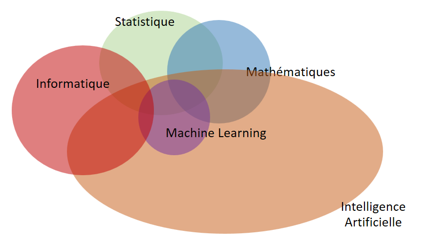
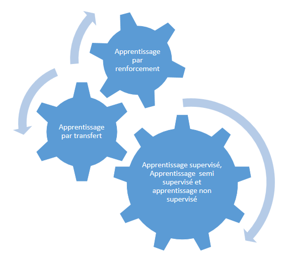
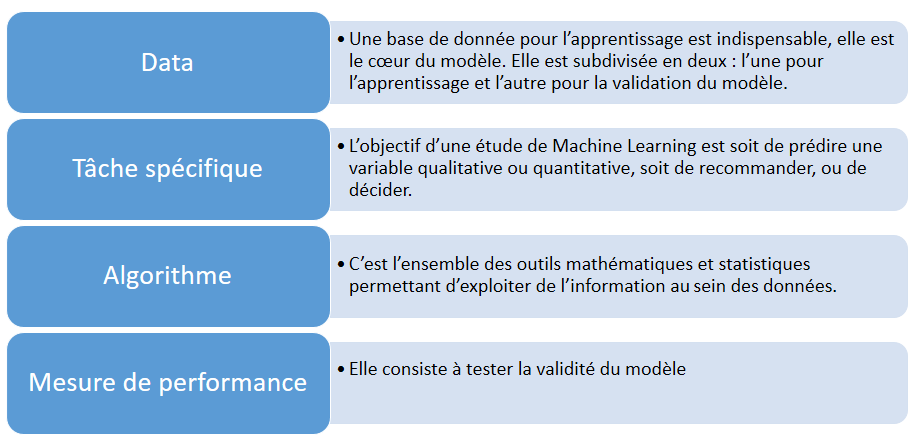
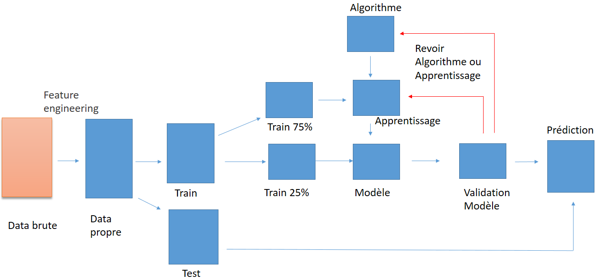

```{r setup, include=FALSE}
knitr::opts_chunk$set(echo = TRUE)
```


***

# {.tabset .tabset-cerulain .tabset-pills}


##Présentation


##Plan


####`Introduction`
####`I. Qu'est-ce que le Machine Learning ?`
####`II. Algorithmes du Machine Learning` 
####`III. Méthodologie de Conception de Modèle à l'aide d'un algorithme du Machine Learning`


##Machine Learning 


>###Introduction


Le Machine Learning est une des branches de l'intelligence artificielle qui date de l'époque de l'invention de l'ordinateur, et du concept de la machine universelle de Alan turing en 1936.


Mais ce n'est qu'en 1959 que l'expression Machine Learning a vu le jour avec l'Informaticien Américain Arthur Samuel à la suite de la création de son programme pour IBM en 1952.


Le Machine Learning s'est développé au cours des années, comme en : 


En 2012, le développement d'un réseau de neurone pour la reconnaissance des visages humains par Google.


En 2016, le développement d'un robot à base d'intelligence artificielle nommé LipNet qui arrive à lire. 

En 2018, Sonde Insight de la NASA pour l'exploration de la planete Mars 


>###I. Qu'est-ce que le Machine Learning ?


L'intelligence artificielle (IA) est " l'ensemble des théories et des techniques mises en oeuvre en vue de réaliser des machines capables de simuler l'intelligence " Wikipedia. 


D'apr?s Arthur Samuel : "Le Machine Learning est le champ d'?tude qui donne aux ordinateurs la capacit? d'apprendre sans être explicitement programmés".

Le Machine Learning définit littéralement comme l'apprentissage automatique en français est une des branches de l'intelligence artificielle qui consiste à fournir des données à la machine afin qu'elle apprenne de celles-ci des relations.  

C'est également définit comme la science de la prédiction.


####`Vue d'ensemble du Machine Learning :`




####`Quand utilise-t-on le machine Learning ? `


Le Machine Learning est utilisé pour diverses raisons : 

* Lorsque l'expertise humain n'existe pas.


* Lorsque les humains n'arrivent pas à expliquer leurs expertises.


* Lorsqu'on ne peut pas programmer la solution pour tous les cas. L'exemple des cas des empruntes biométriques

* ...


####`Le Machine Learning est utilisé dans divers domaines : `


*	Finance : Analyse financière, dont analyse du marché boursier, prédiction de vente, de la consommation ;

* Banque : détection de la fraude ;

* Marketing : satisfaction client, segmentation client, scoring d'appétence ;

*	Santé : classification des séquences d'ADN, le diagnostic médical notamment, bio-informatique ; 

* Teléphonie : detection fraude, panne, optimisation du réseau ;

*	Politique : prédiction des résultats des élections ;

* Assurance, Transport , Recherche,...


>###II. Les algorithmes du Machine Learning 

Il existe plusieurs algorithmes du Machine Learning classés en des familles : 




####`Apprentissage supervis? :`


L'apprentissage est dit supervisé lorsque les données qui entrent dans le processus sont déjà catégorisées (labélisées ) et que les algorithmes doivent s'en servir pour prédire un résultat en vue de pouvoir le faire plus tard lorsque les données ne seront plus catégorisées (labélisées). 

On peut par exemple donner au système une liste de profils clients contenant des habitudes d'achat, et expliquer à l'algorithme lesquels sont des clients habituels et lesquels sont des clients occasionnels. Une fois l'apprentissage terminé, l'algorithme devra pouvoir déterminer tout seul à partir d'un profil client à quelle catégorie celui-ci appartient.

| Nom | Nbre_Article_acheté_Mois | Nbre_passage_Mois | Profil |
|------|:-----|---------|:------:|
| Diallo  Aissata | 31 | 13 | habituel|
| Traoré Mamadou | 5 | 2 | occasionnel |
| Bah Fousseynou | 89 | 27 | habituel |
| ... | ... | ... | ... |

*	les arbres de décision


L'arbre est formé de noeuds, de branches et de feuilles.

Les noeuds représentent les variables, les branches pour indiquer une subdivision et les feuilles pour indiquer le classement.

Comment fonctionne-t-il cet algorithme ?

Le principe est le suivant :

Tout d'abord on subdivise les données en deux par la variable qui semble mieux être significative. Le processus se repète ainsi de suite pour chaque subdivision.


*	Classification naïve bayesienne

$$P(A/B)=\frac{P(B/A).P(A)}{P(B)}$$


*	Régression Logistique


$$Y = \beta_0+\beta_1x_1+\beta_2x_2+\beta_3x_3+...+\beta_nx_n$$


$$logit(p) = \beta_0+\beta_1x_1+\beta_2x_2+\beta_3x_3+...+\beta_nx_n$$

$$logit(p)=log(\frac{p}{1-p})$$

* Boosting

* Machine à vecteurs de support

*	Réseau de neurones

*	Méthode des k plus proches voisins

* Ramdom Forest


####`Apprentissage non supervisé :`

L'apprentissage non supervisé est un peu complexe puisqu'ici le système va devoir détecter les similarités dans les données qu'il reçoit et les organiser en fonction de ces dernières. 


Par exemple : lorsqu'on fournit au système une base de données clients ne sachant rien de celle-ci, et demander à l'algorithme de nous fournir des classes.

| Nom | Nbre_Article_acheté_Mois | Nbre_passage_Mois | 
|------|:-----|---------|
| Diallo Aissata | 31 | 13| 
| Traoré Mamadou | 5 | 2 
| Bah Fousseynou | 89 | 27 |
| ... | ... | ... | 


* Kmeans ou clustering

* Classification ascendante hierachique (CAH)


####`Apprentissage semi supervisé :` 


Comme son nom l'indique, il est à la fois supervisé et non supervisé.
Lorsque nous disposons des données dans lesquelles il existe des observations étiquetées et non étiquetées, l'apprentissage semi supervisé reste le bon algorithme à appliquer dans ce genre de cas.

| Nom | Nbre_Article_acheté_Mois | Nbre_passage_Mois | Profil |
|------|:-----|---------|:------:|
| Diallo Aissata | 31 | 13 | habituel|
| Traoré Mamadou | 5 | 2 | occasionnel |
| Bah Fousseynou | 89 | 27 | NA |
| ... | ... | ... | ... |


>###III. Méthodologie de Conception de Modèle à l'aide d'un algorithme du ML


Avant la méthodologie, sachons d'abord de quoi se définit un modèle ?

Du point de vu Mathématique : 

$$ Soit \ un \ ensemble \  de \ lots \ avec \ leurs \ surfaces \ en \ mètre \ carré \ ( \ v_1 \ variable \ surface \ ) \ et \ leurs \ prix \ en \ FCFA \ 
( \ Y_r \ le \ prix\ réel $$

$$ et  \ Y_p \ le\ prix \ predit \ par \ le \ modèle \ ) $$ 


| Nom | surface $(v_1)$ |...$(v_i)$| Prix $(Y_r)$ | 
|------|:-----|-----|---------:|
| lot 22| 400 |...|20 000 000 | 
| lot 17 |300  |...| 18 000 000 | 
| lot 85 | 800 |...| 50 000 000 | 
| ... | ... | ... |...|


$$ Un \ modèle \ se \ définit\ comme \ : \ Y_p=f(v_1,v_2,v_3,...,v_n)=Modèle $$ 

$$Y_p-Y_r\ soit\ négligeable$$ 

En d'autres termes, le modèle est un système recevant en input differentes variables (quantitatives, qualitatives) pour generer un ou (des) output(s) (quantitatives, qualitatives) de telle sorte que l'output prédit soit sensiblement semblabe à l'output réel.

***

`Les eléments fondamentaux pour la conception de modèle sont les suivants : `



***

`Les étapes du processus de conception de modèle sont les suivantes : `





***


`Pour notre exemple, les étapes sont les suivantes : `

Nous aurons besoin d'une base de données déjà étiquetées (ou cat.). 


* Nettoyage de la base de données (Le feature engineering)

* Division de la base de données en deux  : la première contient au moins les 2/3 de la base de donnée qui servira à la conception du modèle et les 1/3 pour la validation du modèle.

Conception du modèle avec les 2/3 des données : Apprentissage

* Chargement des packages 

* Chargement du jeu de données

* Construction de l'arbre 

* Arbre optimal 

* Prediction des 1/3 des données 

Test de validation 

* La Matrice de confusion

Si le taux de bonne prédiction est meilleur avec moins d'erreur alors le modèle est validé.

Sinon il est important de revoir soit la phase d'apprentissage du modèle, soit le choix du modèle ou soit les données.


##Exemple 


L'exemple dont nous allons présenter va porter sur un cas réel d'un évènement tragique qui s'est déroulé en 1912 :  l'histoire du  Titanic.
Le plus grand bateau de l'époque qui devait rélier l'Angleterre à New York, chavira au fond de l'ocean Atlantique suite d'une collision avec un Iceberg.


***


Dans les estimations, plus d'un millier de personnes etaient à bord de l'engin naval, composé d'hommes, de femmes et d'enfants.
"Les femmes et les enfants d'abord" fut la règle qui a permis à beaucoup de femmes et d'enfants de survivre au naufrage.
Cette règle sera prouver par un des algorithmes que nous allons utiliser.

la base de donnée pour l'illustration de notre exemple contient 891 passagers caracterisés par sept variables.


Train, servira à la conception du modèle (75% de la base pour la conception, 25% pour la validation du modèle).

Les variables sont les suivantes : 

* PassengerId: l'identifiant du passager
* Age: l'age du passager
* Sex: le sexe du passager (Male, femele)
* SibSp: nombre de conjoints et frères/soeurs à bord
* Parch: nombre de parents/enfants à bord
* pclass: la classe dans laquelle le passager a voyagé (1, 2 ou 3)
* Survived : 1 si le passager a survécu, sinon 0


Il consiste dans cette partie de construire un modèle permettant de prédire les chances de survie (1 si le passager a survecu sinon 0) lors du naufrage du Titanic.
L'algorithme que nous allons utiliser est l'arbre de décision, une des méthodes d'apprentissage automatique supervisé,  Il consiste à apprendre des observations déjà  labélisées (étiquetées ou catégorisées) pour constituer un modèle afin de pouvoir prédire le label (la catégorie ou étiquette) d'une nouvelle observation sans label. 

* Commmençons par le chargement des packages permettant d'exploiter l'algorithme des arbres de décision : rpart et rpart.plot

```{r echo = TRUE}

library(rpart)# Pour l'arbre de décision
library(rpart.plot) # Pour la représentation de l'arbre de décision

```


* Après le chargement des packages, nous procederons à la lecture des base de données  : Train et Test  

* Ensuite suivi du nettoyage des données ( la verification du format des variables, ...) 

```{r echo = T}

ptitanic <- read.csv(file="C:/Users/Fousseynou/Desktop/Machine Learning/Data/train.csv", header=TRUE, sep=";")
head(ptitanic) 

ptitanic[,1]<-as.factor(ptitanic[,1])
ptitanic[,2]<-as.factor(ptitanic[,2])
ptitanic[,3]<-as.factor(ptitanic[,3])

ptitanic[,5]<-as.numeric(ptitanic[,5])


```


* Le resumé des données Train

```{r echo = T}
summary(ptitanic)
```

* La structure des données Train
```{r echo = T}
str(ptitanic)
```


* Ici, nous allons subdiviser la base Train en deux grâce à un échantillonage aléatoire :  E1 soit 75% de Train qui servira à la conception du modèle (apprentissage) et E2 soit 25% de Train, pour le test de validation du modèle.
 

```{r echo = TRUE}

#Création d'un dataset d'apprentissage et d'un dataset de validation
nb_lignes <- floor((nrow(ptitanic)*0.75)) #Nombre de lignes de l'échantillon d'apprentissage : 75% du dataset
ptitanic <- ptitanic[sample(nrow(ptitanic)), ] #Ajout de numéros de lignes
ptitanic.train <- ptitanic[1:nb_lignes,-1] #Echantillon d'apprentissage
ptitanic.test <- ptitanic[(nb_lignes+1):nrow(ptitanic),-1] #Echantillon de test


```

* Une fois les données préparées, nous procederons à la constructions de l'arbre par la fonction rpart et l'affichage des plots 

```{r echo = TRUE}

#Construction de l'arbre
# cet objet contient le modèle à l'état brute 
ptitanic.Tree <- rpart(survived~.,data=ptitanic.train,method="class",control=rpart.control(minsplit=5,cp=0))

#Affichage du résultat
#plot(ptitanic.Tree, uniform=TRUE, branch=0.5, margin=0.1)
#text(ptitanic.Tree, all=FALSE, use.n=TRUE)
prp(ptitanic.Tree,extra=1)
print(ptitanic.Tree)

```


* Après construction, nous remarquons un surapprentissage  (apprentissage non optimisé), d'où la nécessité de la minimisation de l'errreur pour définir le nivau d'élagage.


```{r echo = TRUE}
#On cherche à minimiser l'erreur pour définir le niveau d'élagage
plotcp(ptitanic.Tree)


```

* On calcule le CP optimal (paramètre de complexité)
* Elagage de l'arbre avec le cp optimal
* Représentation graphique de l'arbre optimal

```{r echo = TRUE}

#Affichage du cp optimal
print(ptitanic.Tree$cptable[which.min(ptitanic.Tree$cptable[,4]),1])


#Elagage de l'arbre avec le cp optimal
# Modèle optimisé  stocké dans un objet
ptitanic.Tree_Opt <- prune(ptitanic.Tree,cp=ptitanic.Tree$cptable[which.min(ptitanic.Tree$cptable[,4]),1])

#Représentation graphique de l'arbre optimal
prp(ptitanic.Tree_Opt,extra=3)


```


* L'arbe élagué

```{r echo = TRUE}

#Affichage des règles de construction de l'arbre
print(ptitanic.Tree_Opt)

```

* Après construction, nous passons à la prédiction de nouvelles observations 
* Matrice de confusion (une confrontation des prédictions du modèle par rapport aux données Test )


```{r echo = TRUE}
#Prédiction du modèle sur les données de test
ptitanic.test_Predict<-predict(ptitanic.Tree_Opt,newdata=ptitanic.test, type="class")


ptitanic.test_Predict

#Matrice de confusion
mc<-table(ptitanic.test$survived,ptitanic.test_Predict)
print(mc)

```

* Mesure de performance (test de validité)

* On calcule l'erreur de classement 


```{r echo = TRUE}

#Erreur de classement
erreur.classement<-1.0-(mc[1,1]+mc[2,2])/sum(mc)
erreur.classement

```


* Le taux de bonne prédiction 

```{r echo = TRUE}

#Taux de prédiction
prediction=mc[2,2]/sum(mc[2,])
prediction
```


* Après le test de validité du modèle (bon taux de prédiction), on peut stocker le modèle à l'aide du package filehash, chose que l'on peut faire avec d'autres methodes.
L'utilité de créer un fichier contenant le modèle est le suivant :

* Moins de code à exécuter à chaque besoin du modèle 
* Facile à inserer dans un autre programme (comme APP R shiny)


* Cette phase est mise en commentaire car elle a déjà été faite avant. c'est juste pour montrer la manière de stocker le modèle. 

```{r echo = TRUE}

#setwd("C:/Users/BA Modibo/Desktop/Meetup Bamako Data Science/Machine Learning/Modele")

#library(filehash)

#dumpObjects(ptitanic.Tree_Opt,dbName="ptitanic_Modele.db")

```


* Là nous expliquons comment faire l'initialisation du modèle

```{r echo = TRUE}
setwd("C:/Users/Fousseynou/Desktop/Machine Learning/Modele")
# library(filehash)


# db.models <- dbInit("modelDT.db")

# rattacher la base à un environnement
# env.models <- db2env(db.models)

# Predict.Test<-predict(env.models$data.Tree_Opt,newdata=Test, type="class")

# Predict<-cbind(ptitanic,Predict.Test)

# View(Predict)

# write.csv2(Predict,file="Predict.csv")


```
 


##R Shiny app


```{r echo = FALSE}
library(rpart)# Pour l'arbre de décision
library(rpart.plot)
library(shiny)
library(DT)

library(shinyjs) 
# Define UI for application that draws a histogram
ui <- fluidPage(
  
 
   
    fileInput("file1", "Veuillez choisir un fichier CSV",
              multiple = TRUE,
              accept = c("text/csv",
                         "text/comma-separated-values,text/plain",
                         ".csv"),width="730"),


   fluidRow(
     
           
             column(12, downloadButton('down',"Telecharger les données prédites"))
   

   
   )

    


    
   

    


)

server <- function(input, output,session) {
  
  
  

  
  
  RVdata <- reactive({
    
    df  <- read.csv(input$file1$datapath,header=TRUE,sep=";")
    
    
    df[,"PassengerId"]<-as.factor(df[,"PassengerId"])
df[,"Pclass"]<-as.factor(df[,"Pclass"])
df[,"Sex"]<-as.factor(df[,"Sex"])
df[,"Age"]<-as.numeric(df[,"Age"])
 df[,"SibSp"]<-as.integer(df[,"SibSp"])
 df[,"Parch"]<-as.integer(df[,"Parch"])
 row.names(df)<-as.character(df$PassengerId)

 df<-df[,-c(1,2)]
    df
    
    
  })
  
  

  dataR<-reactive({
    req(input$file1)
    library(filehash)

db.models <- dbInit("C:/Users/Fousseynou/Desktop/Machine Learning/Modele/ptitanic_Modele.db")
      env.models <- db2env(db.models)
     ptitanic.test_Predict<-predict(env.models$ptitanic.Tree_Opt,newdata= RVdata(), type="class")
    

    ptitanic.test_Predict
    Pt<-cbind(RVdata(),ptitanic.test_Predict)
    Pt
    
  })
  
 
  output$pp<-renderPrint({
    str(RVdata())
  })
  
  
  
  output$data <- DT::renderDataTable({
    
    req(input$file1)
    
   
    DT::datatable( head(RVdata()[,1:ncol(RVdata())]))
  })
  
  output$down <- downloadHandler(
    
    filename = function() {
      paste("Data_titanic_Prédiction",".csv", sep="")
    },
    content = function(file) {
      write.csv2(dataR(), file, dec=".",sep=";")
    }
  )
  
}

shinyApp(ui = ui, server = server)


```


##Q/A


###`Merci pour votre attention `

###`Questions/Réponses`


